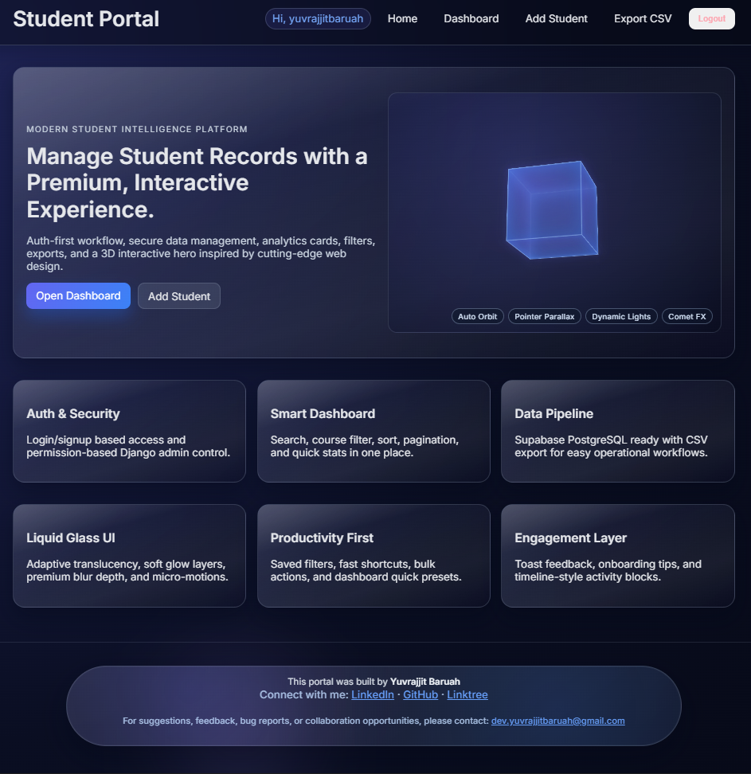
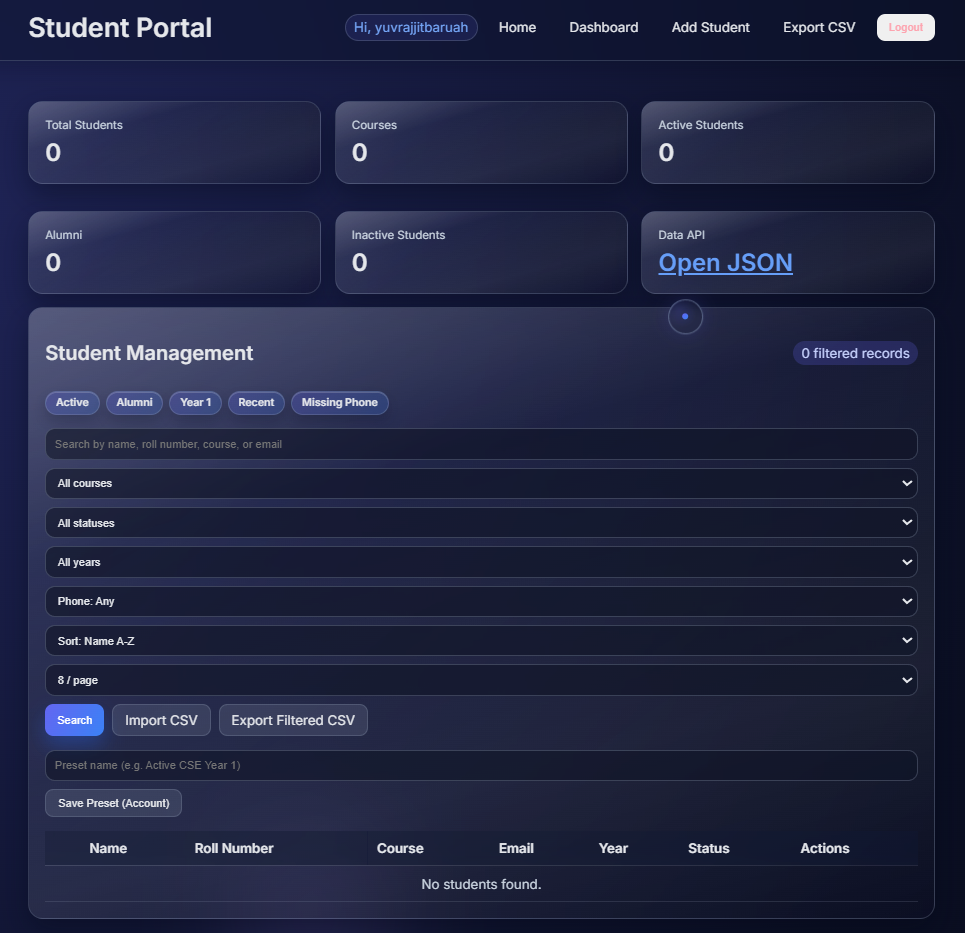
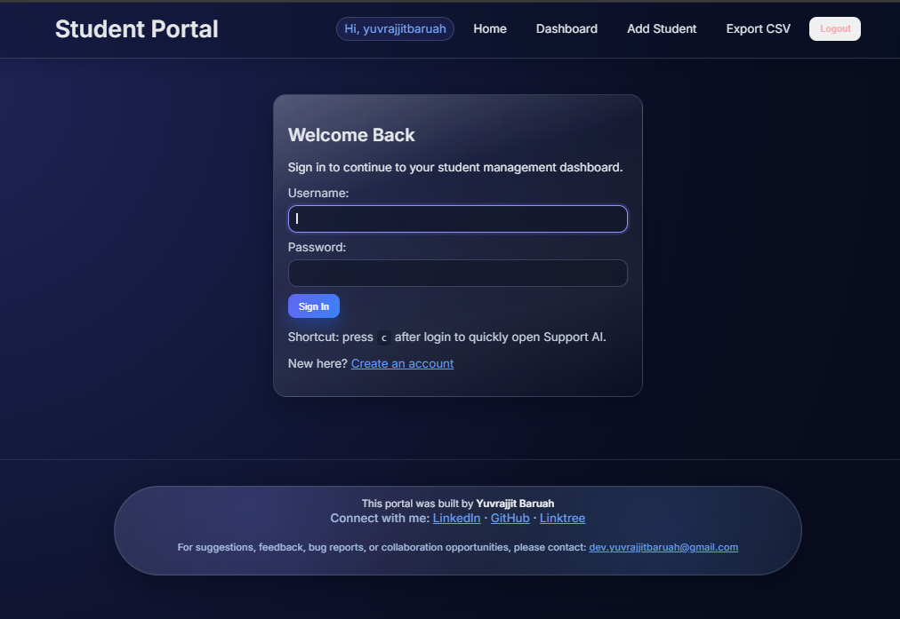
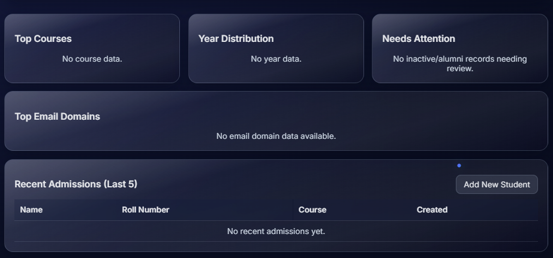
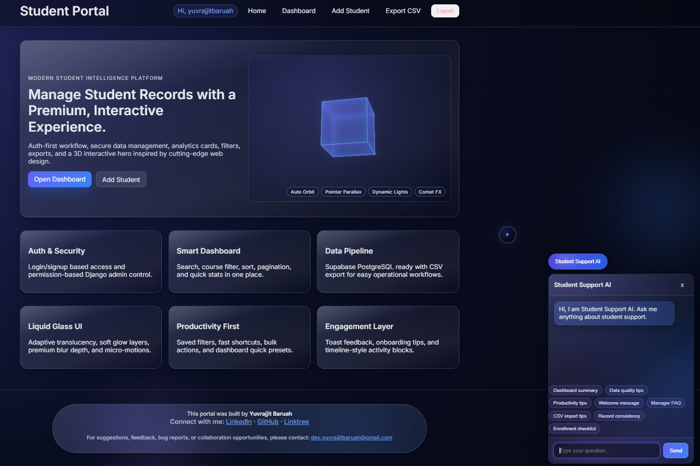
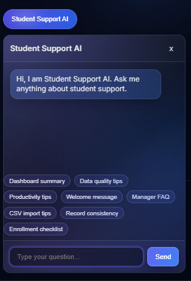
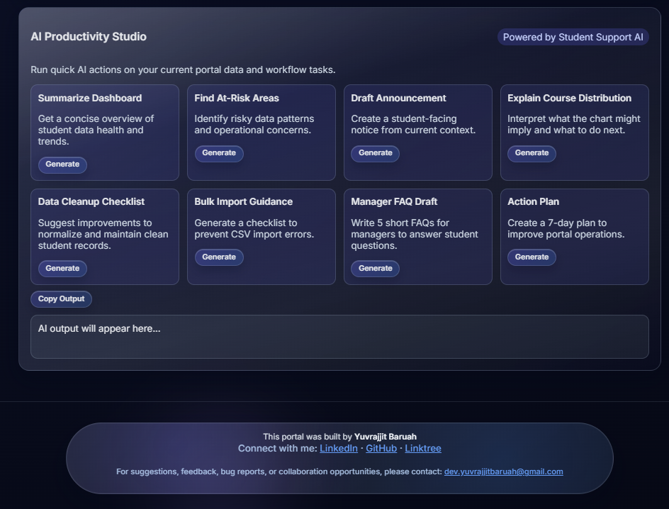

# 🎓 StudentSphere

> Modern Student Management Platform with AI-Powered Assistance


---

## 📖 About StudentSphere

StudentSphere is a modern student management platform built with Django that helps educational institutions efficiently manage student records, authentication, analytics, and AI-powered support.

The platform provides a clean and user-friendly interface for managing student information while integrating AI capabilities to enhance productivity and user experience.

---

## ✨ Features

- 🔐 Secure Authentication System
- 👨‍🎓 Student Records Management
- ➕ Add, Edit & Delete Students
- 📊 Dashboard & Analytics
- 🤖 AI-Powered Student Support Chatbot
- 🔍 Advanced Search & Filtering
- 📱 Responsive User Interface
- 🗄️ PostgreSQL / Supabase Support
- ⚡ Fast Django Backend
- 🎨 Modern User Experience

---

## 📸 Screenshots

### 🏠 Home Page



The landing page of StudentSphere providing quick access to student management features and AI-powered tools.

---

### 📊 Dashboard



A centralized dashboard displaying student information, statistics, and quick actions.

---

### ➕ Add Student



Simple and intuitive interface for adding and managing student records.

---

### 📈 Analytics



Visual insights and analytics to help track student data effectively.

---

### 🤖 AI Chatbot



AI-powered assistant integrated into StudentSphere for student support and guidance.

---

### 💬 AI Chatbot (Clear View)



Expanded chatbot interface for enhanced interaction and readability.

---

### ✨ AI Studio Integration



Demonstration of Gemini AI integration and intelligent assistance features.

---

## 🛠️ Tech Stack

### Backend
- Python
- Django

### Database
- PostgreSQL
- Supabase

### Frontend
- HTML
- CSS
- JavaScript

### AI Integration
- Google Gemini API

---

## ⚙️ Installation

### Clone Repository

```bash
git clone https://github.com/yuvrajjitbaruah/StudentSphere.git
cd StudentSphere
```

### Create Virtual Environment

```bash
python -m venv venv
```

### Activate Virtual Environment

#### Windows

```bash
venv\Scripts\activate
```

#### Linux / macOS

```bash
source venv/bin/activate
```

### Install Dependencies

```bash
pip install -r requirements.txt
```

### Configure Environment Variables

Create a `.env` file using `.env.example`.

Example:

```env
SECRET_KEY=your_secret_key
DEBUG=True
DATABASE_URL=your_database_url
GEMINI_API_KEY=your_api_key
```

### Run Database Migrations

```bash
python manage.py migrate
```

### Start Development Server

```bash
python manage.py runserver
```

Open:

```txt
http://127.0.0.1:8000
```

---

## 🤖 AI Chatbot Configuration

To enable AI chatbot functionality:

1. Create a Gemini API key from Google AI Studio.
2. Add the key to your `.env` file:

```env
GEMINI_API_KEY=your_api_key_here
```

Without a valid API key, the chatbot will remain disabled.

---

## 📬 Feedback & Suggestions

For suggestions, bug reports, feature requests, or collaboration opportunities:

📧 **dev.yuvrajjitbaruah@gmail.com**

---

## 🌐 Connect With Me

### LinkedIn
https://www.linkedin.com/in/yuvrajjitbaruah/

### GitHub
https://github.com/yuvrajjitbaruah

### Linktree
https://linktr.ee/yuvrajjitbaruah

---

## ⭐ Support

If you found this project useful, consider giving it a star on GitHub.

---

## 👨‍💻 Developer

**Yuvrajjit Baruah**

Computer Science & Engineering Student  
AI & Cloud Computing Enthusiast

---

© 2026 Yuvrajjit Baruah. All Rights Reserved.
